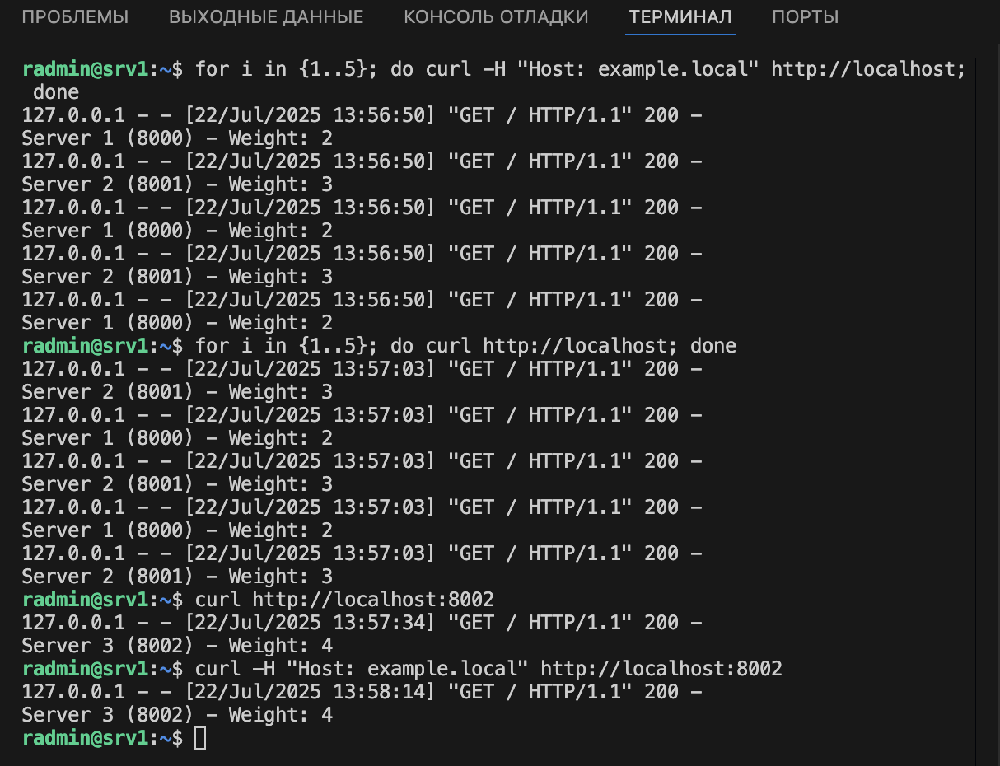

# sflt-homeworks2
# Домашнее задание к занятию 2 «Кластеризация и балансировка нагрузки»

### Задание 1
- Запустите два simple python сервера на своей виртуальной машине на разных портах
- Установите и настройте HAProxy, воспользуйтесь материалами к лекции по [ссылке](2/)
- Настройте балансировку Round-robin на 4 уровне.
- На проверку направьте конфигурационный файл haproxy, скриншоты, где видно перенаправление запросов на разные серверы при обращении к HAProxy.

### Ответ на Задание 1

1. Создание два simple python сервера
```
while true; do echo -e "HTTP/1.1 200 OK\nContent-Type: text/plain\n\nsvc1 8000" | nc -l -p 8000; done #или другой порт

```
2. Установка и настройка HAProxy
```
sudo apt update & sudo apt install haproxy
```
3. Делаем конфигурационный файл HAProxy (/etc/haproxy/haproxy.cfg)

[Конфигурация HAProxy tcp](https://github.com/RomanDiskTop/sflt-homeworks2/blob/main/tcp_haproxy.cfg)

4. Скрин


### Задание 2
- Запустите три simple python сервера на своей виртуальной машине на разных портах
- Настройте балансировку Weighted Round Robin на 7 уровне, чтобы первый сервер имел вес 2, второй - 3, а третий - 4
- HAproxy должен балансировать только тот http-трафик, который адресован домену example.local
- На проверку направьте конфигурационный файл haproxy, скриншоты, где видно перенаправление запросов на разные серверы при обращении к HAProxy c использованием домена example.local и без него.

### Ответ на Задание 2

1. Создаем 3 сервера 
```
mkdir -p /tmp/server1
echo "Server 1 (8000) - Weight: 2" > /tmp/server1/index.html
python3 -m http.server 8000 --directory /tmp/server1 --bind 127.0.0.1 &
```
2. Настраиваем конфиг
[Конфигурация HAProxy http](https://github.com/RomanDiskTop/sflt-homeworks2/blob/main/http_haproxy.cfg)

3. Скрин
